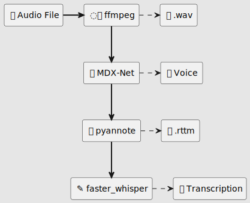

# Verbatim

For high quality multi-lingual speech to text.

## Objectives

### High Quality
Many design decisions favour higher confidence over performance, including multiple passes in several parts to improve analysis.

### Language support

Languages supported by [openai/whisper](https://github.com/openai/whisper) using the [whisper-large-v3](https://huggingface.co/openai/whisper-large-v3) model should also work, including: Afrikaans, Arabic, Armenian, Azerbaijani, Belarusian, Bosnian, Bulgarian, Catalan, Chinese, Croatian, Czech, Danish, Dutch, English, Estonian, Finnish, French, Galician, German, Greek, Hebrew, Hindi, Hungarian, Icelandic, Indonesian, Italian, Japanese, Kannada, Kazakh, Korean, Latvian, Lithuanian, Macedonian, Malay, Marathi, Maori, Nepali, Norwegian, Persian, Polish, Portuguese, Romanian, Russian, Serbian, Slovak, Slovenian, Spanish, Swahili, Swedish, Tagalog, Tamil, Thai, Turkish, Ukrainian, Urdu, Vietnamese, and Welsh

### Mixed language support
Speeches may comprise multiple languages. This includes different languages spoken one after the other (ex. two speakers alternating two languages) or multiple languages being mixed, such as the use of English expressions within a French speech.

### Speaker Identification
The speech recognition distinguishes between speakers using diarization based on  [pyannote](https://github.com/pyannote). 

### Word-Level Confidence
The output provides word-level confidence, with poorly recognized words clearly identified to guide manual editing.

### Time Tracking
The output text is associated with timestamps to facilitate source audio navigation when manually editing.

### Voice Isolation
Verbatim will work on unclean audio sources, for example where there might be music, key strokes from keyboards, background noise, etc. Voices are isolated from other sounds using [adefossez/demucs](https://github.com/adefossez/demucs).

For audit purposes, the audio that was removed because it was considered *background* noise is saved so it can be manually reviewed if necessary.

### Optional GPU Acceleration (on a 12GB VRAM Budget)
The current objective is to limit the VRAM requirements to 12GB, allowing cards such as NVidia RTX 4070 to accelerate the processing.

Verbatim will run on CPU, but processing should be expected to be slow.

### Long Audio Support (2h+)
The main use case for Verbatim is transcription of meeting. Consequently, it is designed to work with files containing at least 2 hours of audio.

### Audio Conversion
A variety of audio formats is support as input, including raw, compressed audio or even video files containing audio tracks. Any format supported by [ffmpeg](https://ffmpeg.org/) is accepted.

### Offline processing
100% offline to ensure confidentiality. The docker image may be executed with `--network none` to ensure that nothing reaches out.

### Output designed for auditing
The output includes 
- a subtitle track rendered over the original audio to review the results.
- a Word document identifying low-confidence words, speaker and timestamps to quickly jump to relevant sections and ensure no part has been omitted

## Processing Pipeline

### 1. Injestion 🔊
Audio Files are converted ◌⃯ to raw audio using [ffmpeg](https://ffmpeg.org/). 

### 2. Voice Isolation 🗩

The voices are isolated using [karaokenerds/python-audio-separator](https://github.com/karaokenerds/python-audio-separator).

### 3. Diarization 🖹

Speakers are identified using [pyannote](https://github.com/pyannote). A diarizaton timeline is created with each speaker being assigned speech periods. When known, it is possible to set the number of speaker in advance for better results.

### 4. Language detection

The language used in each section of the diarization is identified using [SYSTRAN/faster-whisper](https://github.com/SYSTRAN/faster-whisper). For sections that fail to detect properly, the process is repeated with widening windows until the language can be determined with an acceptable level of certainty.

### 5. Speech to Text ✎

We use [SYSTRAN/faster-whisper](https://github.com/SYSTRAN/faster-whisper) for translation, using the [whisper-large-v3](https://huggingface.co/openai/whisper-large-v3) model which support mixture of language. It is still necessary to segment the audio, otherwise whisper eventually switches to translating instead of transcribing when the language requested does not match the speech.

Whisper provides state of the art transcription, but it is prone to hallucinations. A short audio segment may generate speech that does not exist with high level of certainty, making hallucinations difficult to detect. To reduce the likelihood of these occuranges, the audio track is split into multiple audio tracks, one for each `speaker`x`language` pair. Voice activity detection (VAD) is then performed using [speechbrain](https://github.com/speechbrain/speechbrain) to identify large audio segments that can be processed together without compromising word timestamp quality.

We use a different VAD for speaker diarization than speech-to-text processing. [pyannote](https://github.com/pyannote)'s VAD seemed more granular and better suited to identify short segments that may involve change in language or speaker, while [speechbrain](https://github.com/speechbrain/speechbrain)'s VAD seems more conservative, preferring larger segments, making it better suited for grouping large audio segments for speech-to-text while still allowing to skip large sections of silence.

### 6. Output

The output document is a Microsoft Word document which reflects many decisions of the pipeline. In particular, words with low confidence are highlighted for review. SubStation Alpha Subtitles are also provided, based on the implementation of [jianfch/stable-ts](https://github.com/jianfch/stable-ts).

## Sample

Consider the following audio file obtained from [universal-soundbank](https://universal-soundbank.com/sounds/12374.mp3) including a mixture of French and English:

https://github.com/gaspardpetit/verbatim/assets/9883156/23bc86d2-567e-4be3-8d79-ba625be8c614

First, we extract the background audio and remove it from the analysis:

**Background noise:**

https://github.com/gaspardpetit/verbatim/assets/9883156/42fad911-3c15-45c2-a40a-7f923fdd4533

Then we perform diarization and language detection. We correctly detect one speaker speaking in French and another one speaking in English:

**Speaker 0 | English:**

https://github.com/gaspardpetit/verbatim/assets/9883156/cecec5aa-cb09-473e-bf9b-c5fd82352dab

**Speaker 1 | French:**

https://github.com/gaspardpetit/verbatim/assets/9883156/8074c064-f4d2-4ec4-8fc0-c985f7c276e8

The output consists of a word document highlighting words with low certainty (low certainty are underlined and highlighted in yello, while medium certainty are simply underlined):

A subtitle file is also provided and can be attached to the original audio:

https://github.com/gaspardpetit/verbatim/assets/9883156/9bcc2553-f183-4def-a9c4-bb0c337d4c82

